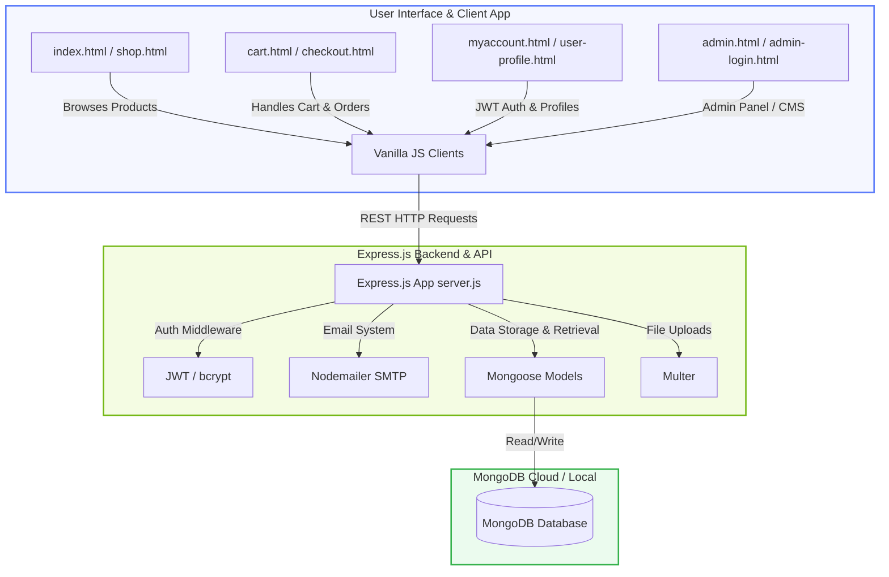
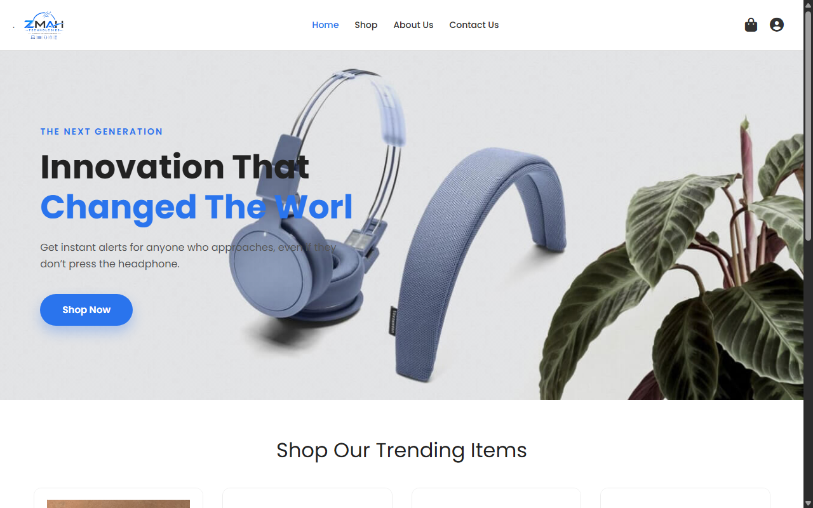
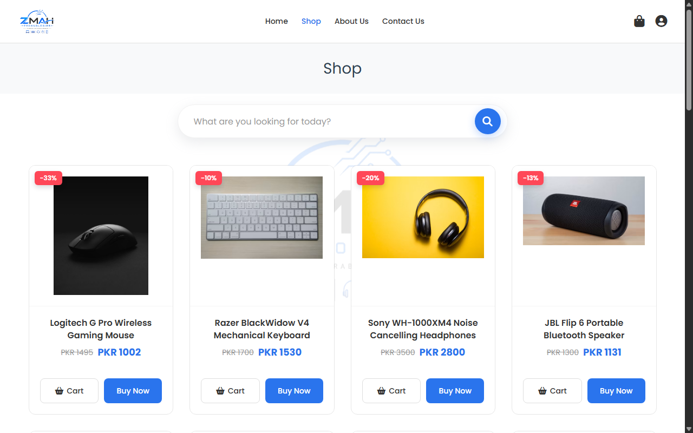
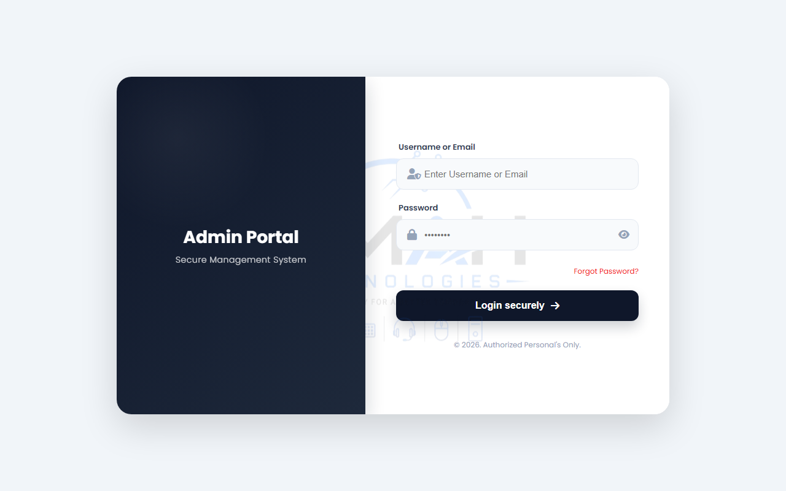
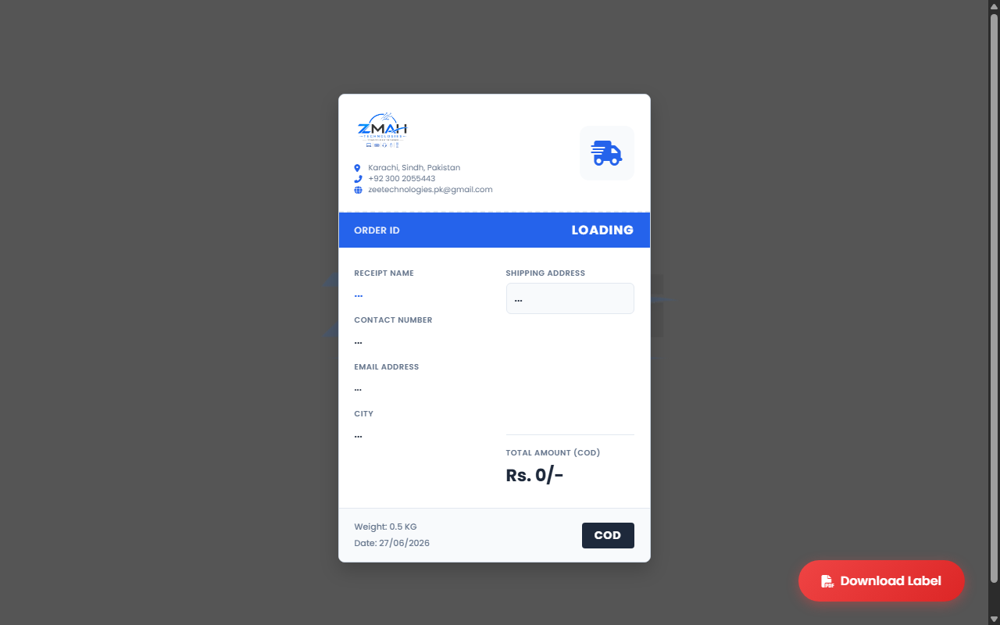

# 🛒 ZMAH Technologies - Full Stack E-Commerce & Admin CMS

<p align="center">
  
</p>

<p align="center">
  
  
  
</p>

---

## 📖 Project Overview

**ZMAH Technologies** is a comprehensive, responsive **Full-Stack E-Commerce Store** featuring a custom, lightweight **Admin CMS Dashboard**. 

Built using the modern **MEN Stack** (MongoDB, Express, Node.js) on the backend and optimized **Vanilla HTML5/CSS3/JavaScript (ES6+)** on the frontend, it delivers an extremely fast, high-performance shopping experience for customers and a feature-rich, interactive portal for store administrators.

---

## 📐 System Architecture

The following diagram illustrates how the frontend components, backend REST API routes, and database models interact:



---

## 🌟 Key Features & Interface Comparison

| Module | Feature Set | Implementation Details | Target Users |
| :--- | :--- | :--- | :--- |
| **🛍️ Storefront UI** | Product Catalog, Search & Live Filter, LocalStorage Cart, Checkout, Contact Forms | Fully responsive grid layout, dynamic DOM rendering, instant client-side search | Consumers |
| **👤 Customer Accounts** | Registration, JWT-based Session, Password Reset via Email OTP, Order History | Secure encryption with `bcryptjs`, temporary OTP verification, stateful user dashboard | Customers |
| **📊 Admin Dashboard** | Business Analytics, Sales Summary, Low Stock Alerts, Order Management | Live statistics aggregation, dynamic order status updates (Pending/Shipped/Delivered) | Administrators / Store Managers |
| **⚙️ Catalog CMS** | Complete CRUD operations for products, Multi-image & Video file uploads | Node backend integration using `Multer` for local media storage and reference validation | Administrators |
| **🖨️ Shipping Logistics** | Instant Air Waybill (AWB) generation & PDF export | Integration of `html2pdf.js` with client-side automated weight and order details calculation | Store Operators |

---

## 📸 Screenshots

<table align="center">
  <tr>
    <td align="center"><b>🏠 Customer Homepage</b></td>
    <td align="center"><b>🛍️ Shop Grid & Filters</b></td>
  </tr>
  <tr>
    <td></td>
    <td></td>
  </tr>
  <tr>
    <td align="center"><b>📊 Admin Dashboard</b></td>
    <td align="center"><b>🖨️ Air Waybill (AWB) Label</b></td>
  </tr>
  <tr>
    <td></td>
    <td></td>
  </tr>
</table>

---

## 📂 Project Structure

```text
ZMAH Technologies /
├── 📁 backend/
│   ├── 📁 models/              # Mongoose Data Schemas (User.js, Product.js, Order.js, OTP.js)
│   ├── 📁 uploads/             # Media storage folder for product images/videos
│   ├── 📜 server.js            # Main entry point (Express app, database connectivity, REST API endpoints)
│   ├── 📜 package.json         # Backend node packages and script definitions
│   └── 📜 .env                 # API keys, database URI, credentials (hidden from Git)
│
├── 📁 frontend/
│   ├── 📁 assets/              # Static frontend resources (Logos, Icons, Banners)
│   ├── 📄 index.html           # Main Landing Page / Featured Products
│   ├── 📄 shop.html            # Shop Listings with Search and Filtering
│   ├── 📄 product-details.html # Dedicated Product Page (Media slides, Reviews, Cart placement)
│   ├── 📄 cart.html            # Shopping Cart summary
│   ├── 📄 checkout.html        # Secure order confirmation page
│   ├── 📄 myaccount.html       # Authentication UI (Login, Registration, OTP request)
│   ├── 📄 user-profile.html    # User profile & past order list
│   ├── 📄 contactus.html       # Contact form with email outreach capabilities
│   ├── 📄 aboutus.html         # Corporate info page
│   ├── 📄 admin-login.html     # Admin Authentication
│   ├── 📄 admin.html           # Core CMS (Product/Order managers & Stats)
│   ├── 📄 admin-revenue.html   # Detailed financial and revenue breakdowns
│   └── 📄 AWB.html             # Printable label invoice template
│
└── 📝 README.md                # Project documentation
```

---

## ⚙️ Installation & Setup

Follow these steps to run the application locally on your machine.

### Prerequisites
* **Node.js** (v16.x or higher)
* **MongoDB** (Local Community Edition or MongoDB Atlas connection string)

### 1. Setup Backend Environment
Create a `.env` file inside the `backend` folder and add the following configurations:
```env
PORT=5000
MONGO_URI=your_mongodb_connection_string
JWT_SECRET=your_jwt_signing_key
EMAIL_USER=your_gmail_address
EMAIL_PASS=your_app_password
```

### 2. Install Dependencies & Launch Backend
```bash
# Navigate to the backend directory
cd backend

# Install dependencies
npm install

# Start backend server in development mode
npm run dev
# OR start normally
node server.js
```
The server will boot up, by default, at `http://localhost:5000`.

### 3. Setup Frontend
To view the storefront and CMS, simply open `frontend/index.html` in your web browser. 

> [!NOTE]
> The frontend scripts point automatically to the local API endpoint (`http://localhost:5000`). If your server port differs, update the endpoint constants at the beginning of the respective javascript codeblocks in the html templates.

---

## 🤝 Contact & Support
For custom development requests or integration queries, contact the team at **ZMAH Technologies**.

